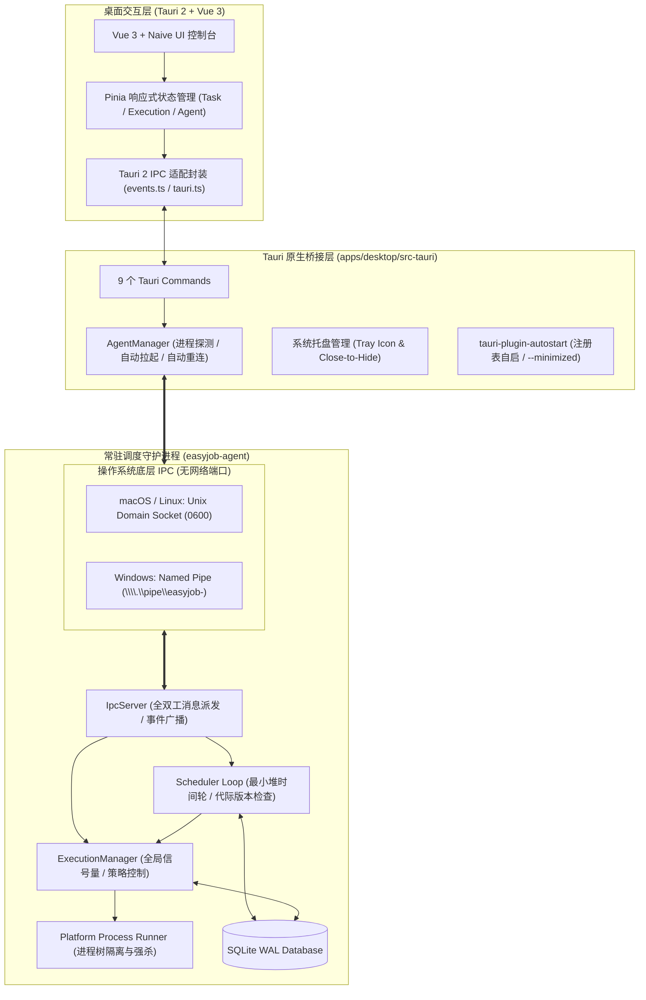

# easyJob - 跨平台本地定时任务调度中心

<div align="center">


### 高性能 · 原生跨平台 · 守护进程解耦 · 极客风格控制台

基于 **Rust + Tauri 2 + Vue 3 + TypeScript + SQLite** 构建的现代化跨平台本地任务定时调度管理中心。

[](https://www.rust-lang.org)
[](https://tauri.app)
[](https://vuejs.org)
[]()
[](LICENSE)

</div>

---

## 📖 目录

- [项目简介](#-项目简介)
- [核心架构原则](#-核心架构原则)
- [主要特性与亮点](#-主要特性与亮点)
- [系统架构图](#-系统架构图)
- [技术栈与包结构](#-技术栈与包结构)
- [快速开始](#-快速开始)
  - [环境准备](#环境准备)
  - [安装与运行](#安装与运行)
- [全栈测试与代码质量](#-全栈测试与代码质量)
- [设计规范与安全性](#-设计规范与安全性)
- [开源许可](#-开源许可)

---

## 🌟 项目简介

**easyJob** 是一款专为开发者、运维人员及个人用户打造的本地自动化任务调度程序。

传统系统计划任务（如 Windows 任务计划程序、macOS launchd/cron）存在语法晦涩、管理分散、无统一实时输出控制台、不可移植等痛点。easyJob 提供开箱即用的跨平台桌面应用，结合底层的 Rust 守护进程，为你的日常自动化脚本和程序提供精准、可靠、可视化的运行环境。

---

## ⚡ 核心架构原则

> **Tauri / Vue 仅负责控制台和用户视窗交互，Rust Agent 负责底层调度、进程执行和状态持久化。**

- **生命周期彻底解耦**：GUI 窗口关闭或隐藏时，后台 Agent 守护进程持续稳定运行，定时任务绝不会因为前端视窗关闭、卡顿或崩溃而中断。
- **纯粹本地 IPC 通信**：Tauri 桌面端与 Agent 守护进程之间严格通过操作系统底层原生 IPC（macOS/Linux: Unix Domain Socket `0600` 私有权限，Windows: 命名管道 Named Pipe）通信，**绝不开设任何外部 TCP/网络端口**，物理级杜绝远程网络攻击面。
- **平台调度纯净性**：所有任务由 easyJob 内部的高精度最小堆时间轮引擎调度，不污染、不依赖操作系统的计划任务服务。

---

## 🚀 主要特性与亮点

### 1. 强大且可视化的多维触发规则（Triggers）
告别复杂的 Cron 表达式，可视化配置五类触发器：
- **一次性触发（Once）**：指定未来的特定日期与时间精确执行。
- **固定间隔触发（Interval）**：支持以秒、分钟、小时为单位的周期循环执行。
- **每天定时触发（Daily）**：指定每天特定时刻（支持时区配置）自动触发。
- **每周定时触发（Weekly）**：支持按周一至周日的多选与指定时间触发。
- **随 Agent 启动（AgentStarted）**：守护进程拉起时立即自动执行。

### 2. 操作系统自适应执行动作（Actions）
- **macOS / Linux**：原生支持执行 **Shell 脚本**（`/bin/sh`）与 **独立可执行程序**，自动隐藏 Windows 专用选项。
- **Windows**：原生支持执行 **CMD 命令行**、**PowerShell 脚本** 与 **独立可执行程序**，自动隐藏 Unix 专用选项。
- **静默后台执行**：通过系统底层 API 静默拉起子进程，绝不弹出命令行黑框；自动重定向并捕获 stdout、stderr、退出码与精确执行耗时（毫秒级）。

### 3. 极客风格终端级实时日志抽屉（Live Streaming Console）
- 采用深色终端风格（`bg-zinc-950`），支持流式日志实时追加、行号显示、自动触底平滑滚动。
- **进程树级联强杀（Kill Process Tree）**：针对耗时或异常卡死的任务，支持一键发送取消指令，级联终止所有衍生子进程。
- 一键复制执行日志、一键清屏与执行结果状态标签展示。

### 4. 开机自启与系统托盘深度集成
- **Windows 纯净注册表方案**：集成官方 `tauri-plugin-autostart` 插件，在 Windows 下直接读写 `HKCU\Software\Microsoft\Windows\CurrentVersion\Run`，**严禁且绝不使用任务计划程序（`schtasks`）**。
- **静默开机自启（`--minimized`）**：默认开启开机自启，开机时直接隐藏主窗口常驻系统托盘，静默运行后台任务。
- **防误关常驻**：点击主窗口关闭按钮自动拦截并最小化至托盘，通过托盘菜单随时呼出主窗口或彻底退出应用。

### 5. 高可靠性并发策略与故障恢复
- **并发控制**：支持“允许并行（AllowParallel）”、“丢弃/跳过（SkipIfRunning）”、“单任务队列排队（QueueOne）”三种策略。
- **全局信号量保护**：防止大量并发任务耗尽系统内存与 CPU 资源。
- **事务性持久化与重启恢复**：采用 SQLite WAL 模式，系统断电或进程重启时，处于运行中的脏状态任务会被自动恢复并标记。

---

## 📐 系统架构图



---

## 🛠 技术栈与包结构

本项目采用现代化的 Cargo Workspace + PNPM Monorepo 组织结构：

```text
easyJob/
├── apps/
│   ├── agent/                      # 后台常驻守护进程 (easyjob-agent)
│   └── desktop/                    # 跨平台桌面端应用 (Tauri 2 + Vue 3 + Naive UI)
│       ├── src/                    # 前端工程 (Pinia, TypeScript, Tailwind CSS)
│       └── src-tauri/              # Tauri 2 原生 Rust 桥接与托盘管理器
├── crates/
│   ├── common/                     # 全局公共错误类型与通用工具
│   ├── domain/                     # 核心领域模型 (Task, Trigger, Action, Policy, Execution)
│   ├── executor/                   # 进程执行器、并发队列与全局信号量控制
│   ├── ipc/                        # 原生本地 IPC 通信协议与行编解码传输
│   ├── logging/                    # tracing 每日滚动归档日志
│   ├── persistence/                # SQLite WAL 存储层与数据库版本迁移
│   ├── platform/                   # 跨平台系统底层适配 (Windows/Unix 进程树与命令行)
│   └── scheduler/                  # 高精度最小堆时间调度循环与规则计算器
├── docs/                           # 架构设计文档与分阶段规范
└── tests/                          # 跨子项目端到端集成测试
```

---

## 🏁 快速开始

### 环境准备

确保本地已安装以下环境：
- **Rust**：1.77+（通过 [rustup](https://rustup.rs/) 安装）
- **Node.js**：18+ 或 20+
- **PNPM**：9+（推荐 `npm install -g pnpm`）
- 操作系统支持：
  - **macOS**：macOS 12 (Monterey) 或更高版本（支持 Apple Silicon 与 Intel）
  - **Windows**：Windows 10 / 11 64 位

---

### 安装与运行

#### 1. 克隆代码仓库
```bash
git clone https://github.com/your-username/easyJob.git
cd easyJob
```

#### 2. 安装前端依赖
```bash
pnpm -C apps/desktop install
```

#### 3. 启动桌面端开发环境
该命令将同时启动前端 Vite 开发服务器与 Tauri 2 桌面容器，后台会自动探测并协同拉起 Agent 守护进程：
```bash
pnpm -C apps/desktop tauri dev
```

#### 4. （可选）独立运行 Agent 后台守护进程
在无桌面环境或调试底层调度时，可直接通过 CLI 独立启动守护进程：
```bash
cargo run -p easyjob-agent -- --daemon
```

#### 5. 编译生产构建
打包桌面客户端安装包（生成 DMG / MSI / 独立免安装文件）：
```bash
pnpm -C apps/desktop tauri build
```

---

## 🧪 全栈测试与代码质量

easyJob 采用严格的测试驱动开发（TDD）与质量把关，代码库拥有完备的自动化测试矩阵：

```bash
# 1. 运行全工作区 Rust 核心测试（79 个测试全部通过）
cargo test --all

# 2. 运行前端 Vitest 单元与组件测试（93 个测试全部通过）
pnpm -C apps/desktop test

# 3. 执行前端 TypeScript 类型检查与生产编译
pnpm -C apps/desktop run build

# 4. 运行 Rust Clippy 严苛静态代码检查（0 错误，0 警告）
cargo clippy --workspace --all-targets -- -D warnings

# 5. 检查 Rust 代码格式规范
cargo fmt --check
```

**测试统计**：**172 项自动化测试用例 100% 通过**，涵盖领域模型序列化、调度循环代际切换、进程树级联终止、IPC 断线重连、前端状态响应性等关键场景。

---

## 🛡 设计规范与安全性

1. **防进程脑裂与内核文件锁**：Agent 启动时采用操作系统的独占内核文件锁（POSIX `flock` / Windows `LockFileEx`），坚决不误杀已运行实例，彻底杜绝多实例同时执行导致的调度脑裂。
2. **严防 Shell 注入**：除明确的 Shell 动作外，外部独立程序的执行严格以 `argv` 数组传递，杜绝拼接字符串引发的注入漏洞。
3. **低资源占用与优雅退出**：采用异步 Tokio 运行时，平时空闲状态 CPU 占用率接近 0%，内存占用极低；接收退出信号时支持平滑优雅停机。

---

## 📄 开源许可

本项目采用 [MIT License](LICENSE) 开源许可证，欢迎贡献代码、提出 Issue 或提交 Pull Request！
