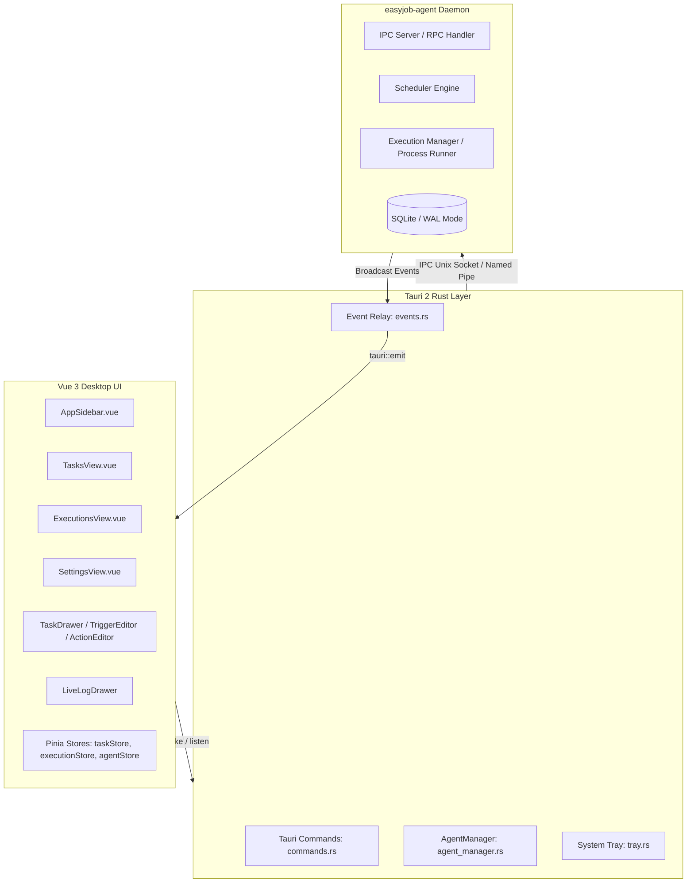

# Phase 3: Tauri 2 + Vue 3 Desktop UI Walkthrough & Verification

## Executive Summary

Phase 3 delivers the complete, cross-platform Desktop User Interface for **easyJob**, powered by **Tauri 2**, **Vue 3**, **Naive UI**, and **Tailwind CSS**. The desktop application connects seamlessly to the background `easyjob-agent` daemon via an auto-reconnecting IPC client over local domain sockets / named pipes, enabling full task lifecycle management, visual trigger/action authoring without cron syntax, and real-time execution monitoring with streaming log playback.

---

## Architecture Overview

---

## Implemented Components & Deliverables

### 1. Tauri 2 + Vue 3 Scaffolding (`apps/desktop`)
- **Vite 6 + Vue 3 + TypeScript** setup with Naive UI and Tailwind CSS.
- Multi-crate Cargo workspace integration with `apps/desktop/src-tauri`.
- Complete application metadata, desktop icons, and bundle configurations.

### 2. Tauri IPC Bridge & System Tray
- **`AgentManager`**: Thread-safe manager maintaining an IPC client connection to `easyjob-agent`, with automatic daemon binary discovery and background process spawning.
- **Tauri Commands**: Full set of RPC methods exposed to the frontend:
  - `get_agent_status`
  - `list_tasks`, `get_task`, `save_task`, `delete_task`, `trigger_task`
  - `list_executions`, `get_execution`, `cancel_execution`
- **Event Relay**: Listens to broadcast events from the agent daemon (`task.updated`, `execution.started`, `execution.output`, `execution.finished`) and forwards them directly to the webview.
- **System Tray**: System tray icon with menu ("显示主窗口", "退出 easyJob") and window close prevention to keep the scheduler running in the background.

### 3. Frontend Architecture & Pinia Stores
- **Domain-Aligned Types**: Strictly typed TypeScript definitions matching Rust domain models (`Task`, `TriggerKind`, `ActionKind`, `Execution`, `AgentStatus`).
- **Tauri Service Layer**: Typed async wrappers over `@tauri-apps/api/core` and event subscriptions.
- **Reactive State Management**:
  - `agentStore`: Connection status polling and agent health metrics.
  - `taskStore`: Task CRUD, search filtering, and trigger execution.
  - `executionStore`: Execution history, real-time log stream buffering, and active run cancellation.

### 4. Layout & Core Views
- **`AppSidebar`**: Brand display, navigation tabs (`任务管理`, `执行记录`, `系统设置`), live Agent connection badge with pulse indicator, and dark/light theme switch.
- **`TasksView`**: Searchable task list, status tags, trigger/action summaries, inline enable/disable toggle, trigger now action, edit/delete controls, and empty state CTA.
- **`ExecutionsView`**: Paginated execution history table, status badges, scheduled/started timestamps, run duration, exit code display, and "查看输出" action.
- **`SettingsView`**: Agent daemon status indicators, IPC path configuration, log directory view, and database location display.

### 5. Visual Task Editor (`TaskDrawer`)
- Slide-out drawer for creating and editing tasks.
- **`TriggerEditor`**: Visual selector supporting all schedule types without requiring cron syntax knowledge:
  - **一次性 (Once)**: Date & time picker.
  - **按间隔 (Interval)**: Human-friendly seconds input with dynamic description ("每 N 秒执行一次").
  - **每天 (Daily)**: Time picker and timezone selector.
  - **每周 (Weekly)**: Multi-select day tags (一/二/三/四/五/六/日) and time picker.
  - **随 Agent 启动 (AgentStarted)**: Startup hook trigger.
- **`ActionEditor`**: Action configuration supporting:
  - **Shell 脚本 (ExecuteShell)**: Multiline script input.
  - **直接运行程序 (ExecuteProgram)**: Executable path and command-line arguments.
- **Policy Settings**: Concurrency policy (`AllowParallel`, `SkipIfRunning`, `QueueOne`), missed run policy (`RunOnce`, `Skip`), timeout, and retry limit.

### 6. Terminal Live Log Console (`LiveLogDrawer`)
- Real-time terminal streaming drawer (`bg-zinc-950 font-mono text-xs text-zinc-200`).
- Streaming log buffer with auto-scroll to bottom, toggleable via switch.
- "终止执行" (Cancel Execution) button for running processes with confirmation.
- Terminal utilities: copy logs to clipboard, clear current viewport, and empty-state fallback.

---

## Verification Summary

All verification gates have been executed and confirmed passing:

| Verification Gate | Command | Result | Details |
| :--- | :--- | :--- | :--- |
| **Rust Workspace Tests** | `cargo test --all` | **PASS** | **79 tests passed**, 0 failed across all 11 workspace crates and root integration suites |
| **Rust Clippy Lint** | `cargo clippy --workspace --all-targets -- -D warnings` | **PASS** | **0 warnings, 0 errors** across all crates |
| **Rust Code Formatting** | `cargo fmt --check` | **PASS** | 100% compliant with Rust formatting guidelines |
| **Frontend Unit Tests** | `pnpm -C apps/desktop test` | **PASS** | **87 tests passed** across 4 Vitest test suites (100%) |
| **Frontend Production Build** | `pnpm -C apps/desktop run build` | **PASS** | `vue-tsc --noEmit` passed with 0 errors; Vite bundle built in 3.11s |
| **Tauri Desktop Crate Check** | `cargo check -p easyjob-desktop` | **PASS** | 0 warnings, 0 errors |

### Total Test Count
- **Automated Tests**: **166 tests passed** (79 Rust + 87 TypeScript/Vitest).
